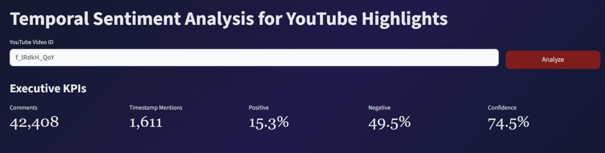

# Temporal Sentiment Analysis for YouTube Highlights

## Title Page & Authors

### Authors
- Faris Ayman – 202210206

### Supervised by
- Husam Barham

### Course
- 307498 – Graduation Project

### Semester
- Second Semester, 2025/2026

### Date
- 08/06/2026

---

# Table of Contents

- [Abstract](docs/documentation.md#abstract)
- [Acknowledgment](docs/documentation.md#acknowledgment)
- [Business Intelligence Project Description and Objectives](docs/documentation.md#business-intelligence-project-description-and-objectives)
- [Data Research and Acquiring Effort](docs/documentation.md#data-research-and-acquiring-effort)
- [Data Description and Understanding](docs/documentation.md#data-description-and-understanding)
- [Data Primary Cleaning and Transformation](docs/documentation.md#data-primary-cleaning-and-transformation)
- [Data Visualization and Insights](docs/documentation.md#data-visualization-and-insights)
- [Dashboard Design & Business Insights](docs/documentation.md#dashboard-design--business-insights)
- [Advanced Analytics and AI Modeling](docs/documentation.md#advanced-analytics-and-ai-modeling)
- [Tools Research and Selection Effort](docs/documentation.md#tools-research-and-selection-effort)
- [Project Deployment Effort – Use Case](docs/documentation.md#project-deployment-effort--use-case)
- [Results](docs/documentation.md#results)
- [References](docs/documentation.md#references)

---

# Abstract

Temporal Sentiment Analysis for YouTube Highlights is a Business Intelligence and Artificial Intelligence project designed to identify the most engaging moments within YouTube videos through timestamp-based audience comments. Traditional video analytics provide aggregate metrics such as views, likes, and watch time but do not reveal which exact moments generated the strongest audience reactions. This project addresses that limitation by analyzing timestamp references embedded within viewer comments.

The system collects comments using the YouTube Data API v3, extracts timestamp references through regular expression matching, performs sentiment analysis using a transformer-based RoBERTa model, and combines engagement metrics such as likes and replies to identify important video segments. The processed data is visualized through an interactive Streamlit dashboard that supports exploratory analysis and highlight discovery.

The results demonstrate that timestamp comments are effective indicators of audience attention and engagement. By combining sentiment analysis, temporal analytics, and engagement metrics, the system successfully discovers meaningful video highlights and transforms unstructured audience feedback into actionable business insights.

---

# Dashboard Preview



---

# Project Highlights

- Automatic timestamp extraction from YouTube comments
- AI-powered sentiment analysis using RoBERTa
- Audience engagement measurement through likes and replies
- Highlight detection using a custom Peak Score algorithm
- Interactive Streamlit dashboard
- Business Intelligence visualizations and insights

---

# Technology Stack

## Data Collection
- YouTube Data API v3

## Data Processing
- Python
- Pandas
- Regular Expressions

## Machine Learning
- Hugging Face Transformers
- Cardiff NLP RoBERTa Sentiment Model

## Visualization
- Plotly

## Dashboard Development
- Streamlit

## Development Tools
- Visual Studio Code
- Git
- GitHub

---

# Project Deployment Effort – Use Case

## End Users

- Content Creators
- YouTubers
- Marketing Teams
- Researchers
- Media Organizations

## Workflow

1. User enters a YouTube Video ID.
2. Comments are retrieved through the YouTube API.
3. Timestamp references are extracted.
4. Data is cleaned and transformed.
5. Sentiment analysis is performed.
6. Engagement metrics are calculated.
7. Important video moments are ranked.
8. Results are visualized through the dashboard.

## Deployment Method

Interactive Streamlit Web Application.

## Future Deployment Options

- Streamlit Cloud
- Render
- Railway
- AWS
- Microsoft Azure

---

# Results

The developed system successfully identifies high-interest moments within YouTube videos using timestamp-based audience comments. By combining sentiment analysis with engagement indicators such as likes and replies, the system generates meaningful rankings of important video segments.

The dashboard transforms complex audience behavior into intuitive visualizations that help users understand audience sentiment, identify influential discussions, and discover video highlights efficiently.

Overall, the project demonstrates how Business Intelligence and Artificial Intelligence can be combined to provide deeper insights into audience engagement beyond traditional video analytics.

---

# Code Setup and Dependencies

## 1. Clone Repository

```bash
git clone <repository-url>
```

## 2. Navigate to Project Folder

```bash
cd Temporal-Sentiment-Analysis
```

## 3. Create Virtual Environment

```bash
python -m venv .venv
```

## 4. Activate Virtual Environment

### Windows

```bash
.venv\Scripts\activate
```

### Linux / macOS

```bash
source .venv/bin/activate
```

## 5. Install Dependencies

```bash
pip install -r requirements.txt
```

## 6. Configure API Key

Create a `.env` file:

```env
YOUTUBE_API_KEY=YOUR_API_KEY
```

## 7. Run Application

```bash
streamlit run dashboard.py
```

---

# Documentation

The complete project documentation is available in:

```text
docs/documentation.md
```

This document contains detailed explanations of:

- Data acquisition
- Data preprocessing
- Exploratory data analysis
- Dashboard design
- AI modeling
- Business insights
- Results and recommendations

---

# References

- Google Developers. (2025). YouTube Data API v3 Documentation.
- Hugging Face. (2025). Transformers Documentation.
- Cardiff NLP. (2025). Twitter RoBERTa Sentiment Model.
- Plotly Technologies Inc. (2025). Plotly Documentation.
- Streamlit Inc. (2025). Streamlit Documentation.
- Pandas Development Team. (2025). Pandas Documentation.

