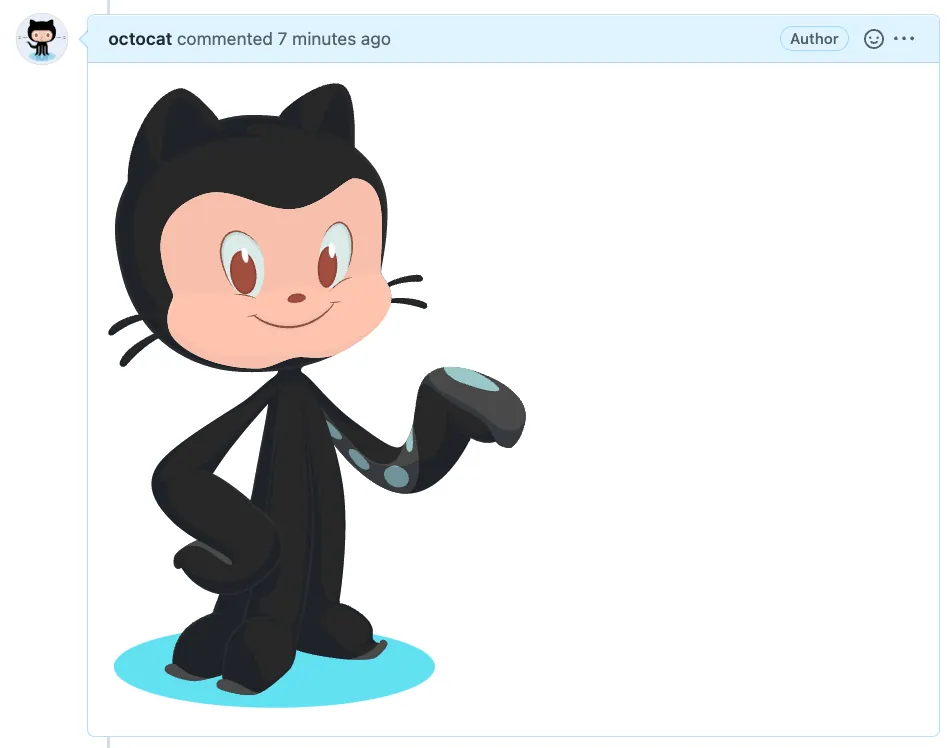

---

## [Documentation Template Sections](docs/documentation.md)

## [**Title Page & Authors**](docs/documentation.md#title-page-authors)
```
[Insert Title Here]

Authors
- [Student Name], [Student Number]
- [Student Name], [Student Number]

Supervised by: [Supervisor Name]

Course: 307498 – Graduation Project
Semester: First Semester, 2025/2026

Date: [Submission Date]
```

## [Table of Content](docs.domcumentation.md#table-of-content) 

- ### [**Abstract**](docs/documentation.md#abstract)
- ### [**Acknowledgment**](docs/documentation.md#acknowledgment)
- ### [**Business Intelligence Project Description and Objectives**](docs/documentation.md#business-intelligence-project-description-and-objectives)
- ### [**Data Research and Acquiring Effort**](docs/documentation.md#data-research-and-acquiring-effort)
- ### [**Data Description and Understanding**](docs/documentation.md#data-description-and-understanding)
- ### [**Data Primary Cleaning and Transformation**](docs/documentation.md#data-primary-cleaning-and-transformation)
- ### [**Data Visualization and Insights**](docs/documentation.md#data-visualization-and-insights)
- ### [**Dashboard Design & Business Insights**](docs/documentation.md#dashboard-design--business-insights)
- ### [**Advanced Analytics and AI Modeling**](docs/documentation.md#advanced-analytics-and-ai-modeling)
- ### [**Tools Research and Selection Effort**](docs/documentation.md#tools-research-and-selection-effort)
- ### [**Project Deployment Effort – Use Case**](docs/documentation.md#project-deployment-effort-use-case)
- ### [**Results**](docs/documentation.md#results)
- ### [**References**](docs/documentation.md#references)


## [**Abstract**](docs/documentation.md#abstract)
A concise summary of your project (2-3 paragraphs):
- 1 paragraph: Introduction and objectives
- 1 paragraph: Implementation approach and methods
- 1 paragraph: Key results and findings

## [**Acknowledgment**](docs/documentation.md#acknowledgment)
Acknowledge individuals and organizations that supported your project.

## [**Business Intelligence Project Description and Objectives**](docs/documentation.md#business-intelligence-project-description-and-objectives)
- What is your project about?
- What industry or business domain does it address?
- How will it help the industry/business?
- What specific business problems are you solving?

## [**Data Research and Acquiring Effort**](docs/documentation.md#data-research-and-acquiring-effort)
- What data did you search for and why?
- How did you acquire it? Sources, APIs, Scraping.
- **Links to raw data sources** (URLs, datasets)
- Brief description of each data source

## [**Data Description and Understanding**](docs/documentation.md#data-description-and-understanding)
- **Data Dictionary**: Describe every field you're using and why it matters
- **Exploratory Data Analysis (EDA)**:
  - Charts and graphs showing data distribution
  - Patterns discovered
  - Correlations and relationships found
  - Insights relevant to your project objectives

## [**Data Primary Cleaning and Transformation**](docs/documentation.md#data-primary-cleaning-and-transformation)
Describe all data preparation steps in sequence:
- Data type conversions
- Handling missing values
- Merging datasets
- Aggregation and appending
- Any other transformations applied

## [**Data Visualization and Insights**](docs/documentation.md#data-visualization-and-insights)
- Include relevant charts and describe each one
- Explain the significance of each visualization
- Highlight key insights from your charts
- What patterns do these visualizations reveal?

## [**Dashboard Design & Business Insights**](docs/documentation.md#dashboard-design--business-insights)
- Showcase your final BI Dashboard
- Organize by **Business Questions Answered**

For each chart/component:
```
Chart [#]: [Title]
Description: [What does this chart show?]
Insight Derived: [What does this tell the business? Why is this important?]
```

Examples:
- Chart 1: Sales Trend Analysis – Shows growth pattern


> The chart shows a cat

- Chart 2: Customer Segmentation – Identifies high-value segments
- Chart 3: Regional Performance – Highlights top/bottom performers

## [**Advanced Analytics and AI Modeling**](docs/documentation.md#advanced-analytics-and-ai-modeling)
- What type of model did you build? (Clustering, Predictive, Association, Generative AI, forecasting, agents, etc.)
- What pre built AI models did you use and how?
- What results were you seeking or what attribute are you predicting?
- **Model Characteristics**: Such as Accuracy, precision, recall, weights, parameters
- Include multiple iterations if applicable
- Explain your findings and model performance

## [**Tools Research and Selection Effort**](docs/documentation.md#tools-research-and-selection-effort)
- What tools did you evaluate?
- Which tools did you ultimately choose?
- Why did you select these tools?
- How do they support your project?

Examples:
- Data Analysis: Python, R, SQL
- Visualization: Tableau, Power BI, Looker
- Deployment: Streamlit, Fast API, Gradio, Flask, Cloud platforms

## [**Project Deployment Effort – Use Case**](docs/documentation.md#project-deployment-effort-use-case)
- How will a business user consume this project?
  - Interactive web dashboard (Streamlit)?
  - Scheduled reports?
  - Dashboard
  - Live API?
  - Mobile app?
- Implementation steps in chronological order
- If you built a prototype, describe deployment process
- Infrastructure and hosting considerations

## [**Results**](docs/documentation.md#results)
- Summary of findings (2-3 paragraphs)
- Most important insights or charts in your opinion
- Evaluation and interpretation of results
- Business impact and recommendations

## [**References**](docs/documentation.md#references)
List all sources cited in your project using a consistent citation format (APA, Chicago, etc.)

---

## Code setup and dependencies Instructions
Write procedure for setup and running code.
for example:
1. Clone the repository: 
   ```bash
   git clone <repository-url>
   ```
2. Navigate to the project directory: 
   ```bash
   cd <project-directory>
   ```
3. Install dependencies:
   ```bash
   pip install -r requirements.txt
   ```
4. Run the application: 
   ```bash
   python app.py
   ```

---


## Documentation Best Practices

✅ **Do's:**
- Write in clear, descriptive language documenting your work effort.
- Use consistent formatting and headings
- Include visuals (charts, screenshots, diagrams)
- Add links to your data sources and tools
- Update regularly as your project evolves
- Use version control (git commits with meaningful messages)

❌ **Don'ts:**
- Don't use Word documents – use Markdown (.md) here [Documentation](docs/documentation.md) for project documentation and version control, link main sections of documentation at the readme overview and Table of Content, as shown in the template.
- Don't commit large data files directly – use `.gitignore` and reference external sources
- Don't leave sections incomplete – mark as TODO if not ready
- Don't forget to document your data sources and methodology

---

## Flexibility by Project Type

**This template is flexible.** Adapt based on your project focus:

| Project Type | Emphasis | Key Sections |
|---|---|---|
| **Dashboard-Heavy** | Visualization & Design | Sections 8-9 (Dashboard, Visualizations) |
| **Predictive Analytics** | Advanced Modeling | Section 10 (AI/ML Modeling) |
| **Data Engineering** | Cleaning & Transformation | Section 7 (Data Prep) |
| **Business Analysis** | Insights & Recommendations | Sections 5-6, 13 (Data, Results) |
| **Web Application** | Deployment & Use Cases | Section 12 (Deployment) |

---

